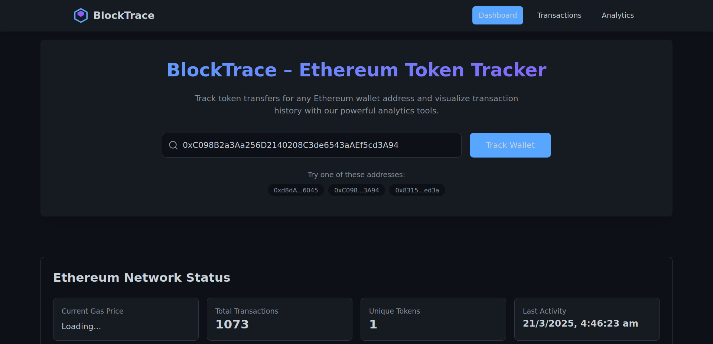
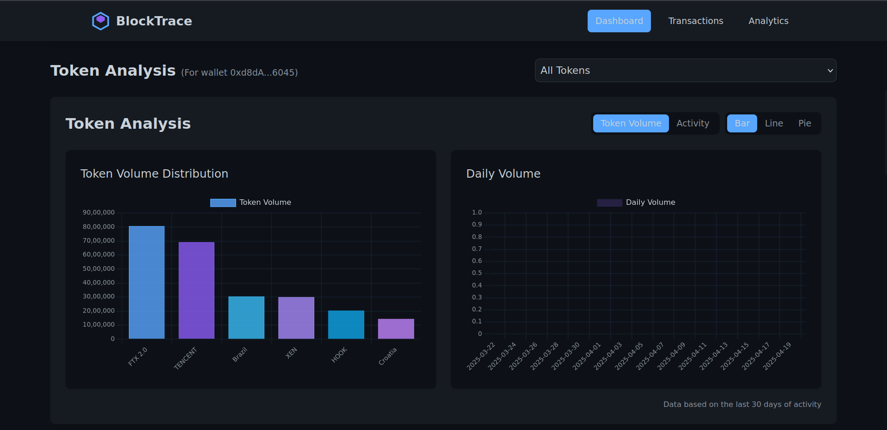
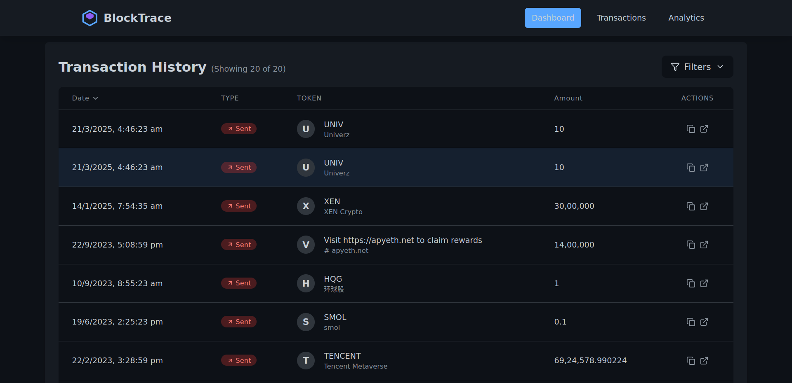

# ⚡ Block Trance
  
Block Trance tracks your wallet activity, fetches transaction history, visualizes trends, and gives you peace of mind — all in a dark, stylish UI.

---

## 🚀 Features

- ✅ **Real-Time Wallet Tracking**  
  Fetch ETH wallet balances, transaction history, and gas usage instantly.

- 📊 **Market-Style Analytics**  
  Interactive charts and graphs to visualize wallet activity like you're watching ETH on Wall Street.

- 🔍 **Transaction Filtering & Search**  
  Filter by incoming/outgoing, date range, and transaction hash.

- 🧩 **Modular, Dynamic UI**  
  Clean component architecture with reusable modules and proper spacing. Responsive across all devices.

- 🌒 **Dark Theme Done Right**  
  Sleek dark UI using custom palette: `#011082`, `#0052FF`, `#546084`, `#ffffff`, `#434345`, and off-white.

- ⚙️ **Error Handling & Validation**  
  Clear messages when APIs fail or wallet addresses are invalid. Ethereum address validation via `ethers.js`.

- 🔁 **Pagination & Infinite Scrolling**  
  Smooth performance even with hundreds of transactions.

---

## ✅ To-do

- Smart Contract to Log Custom Transactions
- Decentralized Portfolio Tracker
- Create a Block Trance Token

---

## 🖼️ UI Preview

---

## 📦 Tech Stack

- **Frontend:** React.js, TailwindCSS, Recharts  
- **Backend:** Node.js, Express.js  
- **Ethereum API:** Etherscan API, `ethers.js`  
- **State Management:** Zustand (or Redux, if you fancy)  
- **Charting:** Recharts (market-style graphing)

---

## 🛠️ Installation

### Clone the Repo
<pre> cd block-trance </pre>
### Install Dependencies
- Frontend:
<pre> cd client 
  npm install </pre>
- Backend:
<pre> cd server 
  npm install </pre>

---

## 🧪 Run Locally

### Backend:
<pre> cd server 
  npm start </pre>

### Frontend:
<pre> cd client 
  npm run dev </pre>

- App will run on: http://localhost:5173

- Backend API on: http://localhost:5000

---

## 👨‍💻 Contributing
Got ideas? Bugs? PRs are welcome!
Fork the repo, make your changes, and raise a pull request like a champ.

---

## 🛡 License
MIT © 2025 [Ishan Upadhyaya]
